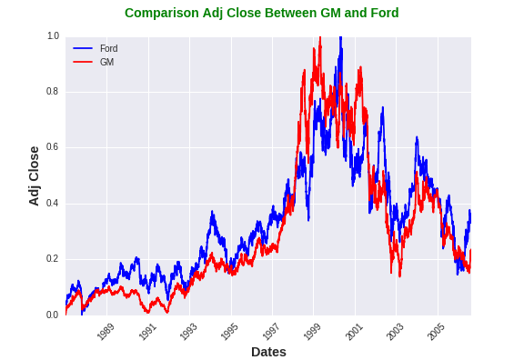

#####**Statistical Data Science For Finance**

This is the study notes of [Statistics and Data Analysis for Financial Engineering: with R examples (Ruppert & Matteson)](http://www.amazon.com/gp/product/1493926136/ref=pd_lpo_sbs_dp_ss_1?pf_rd_p=1944687442&pf_rd_s=lpo-top-stripe-1&pf_rd_t=201&pf_rd_i=1461427495&pf_rd_m=ATVPDKIKX0DER&pf_rd_r=198H9KA13REH1NBMJ8C2 "Statistics and Data Analysis for Financial Engineering: with R examples (Ruppert & Matteson)")  using IPython notebook. This text is written in R. I tried to cover book examples, and excercises in Python.

**1)**  [Returns](https://github.com/abhipr1/Statistical-Data-Analysis-for-Finance/tree/master/Returns "Returns")
            
